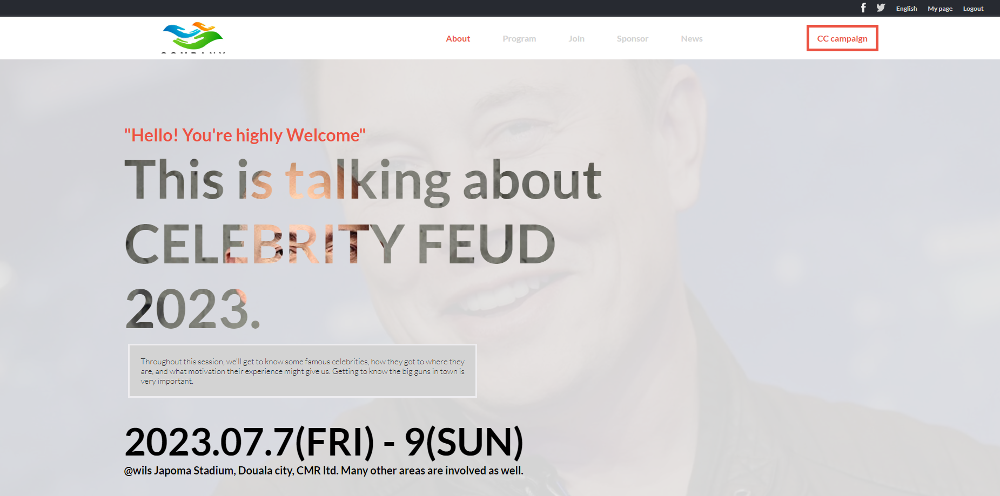

# Capstone-1

  # Nji Wilsan N.
   

  <h3><b>My first Capstone project</b></h3>

# 📗 Table of Contents

- [📖 About the Project](#about-project)
  - [🛠 Built With](#built-with)
    - [Tech Stack](#tech-stack)
    - [Key Features](#key-features)
  - [🚀 Live Demo](#live-demo)
- [💻 Getting Started](#getting-started)
  - [Setup](#setup)
  - [Prerequisites](#prerequisites)
  - [Install](#install)
  - [Usage](#usage)
  - [Run tests](#run-tests)
- [👥 Authors](#authors)
- [🔭 Future Features](#future-features)
- [🤝 Contributing](#contributing)
- [⭐️ Show your support](#support)
- [🙏 Acknowledgements](#acknowledgements)
- [📝 License](#license)

# 📖 CAPSTONE-1

This is my first Micronaut capstone project. Some complex coding is required for this exercise. The goal is to master all of the tools and best practices learned in previous steps. 
- HTML and CSS best practices, Linters documentation, JavaScript.

## 🛠 Built With 

### Tech Stack 

  
Frontend developer

  <ul>
    <li>HTML</li>
    <li>CSS</li>
    <li>js</li>
    <li><a href="https://fonts.googleapis.com"><li>
  </ul>

### Key Features 

- Added index.html file
- Added style.css file
- Added index.js file
- Included Linters

(<a href="#readme-top">back to top</a>)

## 🚀 Live Demo 

- [Live Demo](Coming soon)
- [Live Demo](https://wils-fourr-speed.github.io/Capstone-1/)

(<a href="#">back to top</a>)

## 💻 Getting Started 

To get a local copy up and running, follow these steps.

### Prerequisites

In order to run this project you need:

1. A Code Editor like:
- VSCode
- Atom, etc.

2. NodeJs extension installed in your code editor.

3. A Web Browser like
- Google Chrome
- Firefox
- Microsoft Edge
- Opera, etc.

### Setup

Clone this repository to your desired folder:

git clone https://github.com/Wils-FOURR-speed/Capstone-1.git

### Install

Install this project with:

Run this command:

...sh
  cd my-project
  npm install
  ...

### Usage

To run the project, execute the following command:

Example command:
Open the index.html using live server.

### Run tests

To run tests, run the following command:

- To trace all linter errors, run
  ...

  npx hint .
  ...
- To check any styling error, run  
  ...

  npx stylelint "**/*.{css,scss}"
  ...
- To trace any JavaScript error, run
  ...

  npx eslint .
  ...

## 👥 Author 

👤 **Wilsan**

- GitHub: [@githubhandle](https://github.com/Wils-FOURR-speed)
- Twitter: [@twitterhandle](https://twitter.com/WFourrspeed)
- LinkedIn: [LinkedIn](https://www.linkedin.com/in/nji-wilsan-ndenge-47b7a826a/)

(<a href="#readme-top">back to top</a>)

## 🔭 Future Features 

- [ ] Add more transitions and animations effects

(<a href="#readme-top">back to top</a>)

## 🤝 Contributing 

Contributions, issues, and feature requests are welcome!

Feel free to check the [issues page](https://github.com/Wils-FOURR-speed/Capstone-1/issues).

(<a href="#readme-top">back to top</a>)

## ⭐️ Show your support 

If you like this project, please give me a star.

(<a href="#readme-top">back to top</a>)

## 🙏 Acknowledgments 

Big thanks to:
- Microverse
- The original author of this wonderful design, Cindy Shin in Behance.

(<a href="#readme-top">back to top</a>)

(<a href="#readme-top">back to top</a>)

## 📝 License 

This project is [MIT](./LICENSE) licensed.

(<a href="#readme-top">back to top</a>)
